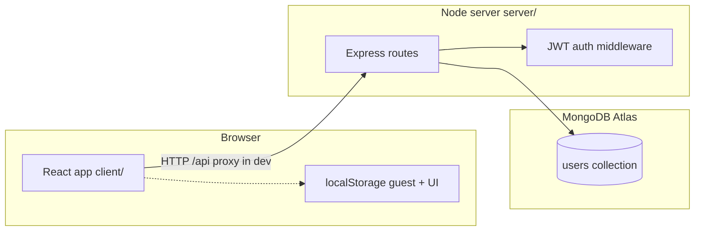

# DSA Tracker — Developer documentation (full project)

This document explains **everything in this repository** in plain language so a new developer or fresher can understand how the app works, where execution starts, how the frontend talks to the backend and database, and what each major file and function does.

---

## 1. What this project is (one paragraph)

**DSA Tracker** helps someone preparing for coding interviews track:

- Problems completed on a **topic-wise “sheet”** (LeetCode-style list),
- A **daily practice plan** (curated problems per day),
- A **streak** (which calendar days you “checked in”),
- **UI state** like which topic sections are expanded.

The **modern app** is a **React (Vite) frontend** in `client/` plus an **Express + MongoDB API** in `server/`. The repo also keeps **older static HTML/JS** versions that work without Node (legacy).

---

## 2. Big picture architecture

- **Frontend** (`client/`): UI, routing, tabs, saves progress for guests in `localStorage`, sends progress to API when logged in.
- **Backend** (`server/`): REST API, validates input, hashes passwords, issues JWTs, reads/writes user documents in MongoDB.
- **Database**: MongoDB (typically **Atlas**). One **User** document per account holds nested **progress** (arrays of IDs and streak dates).

---

## 3. Where programs “start” (entry points)

### 3.1 Active full-stack app — frontend

| What | File | What happens |
|------|------|----------------|
| **HTML shell** | `client/index.html` | Defines `
` and loads the Vite module entry. |
| **JavaScript/React entry** | `client/src/main.jsx` | Calls `createRoot(...).render(<App />)` — this is the **first React code** that runs. |
| **App composition** | `client/src/App.jsx` | Wraps the UI in `BrowserRouter`, `ThemeProvider`, `AuthProvider`, and defines **routes**. |

**Flow:** Browser opens Vite dev server → `index.html` → `main.jsx` → `App.jsx` → a page component (`Tracker`, `Login`, etc.).

### 3.2 Active full-stack app — backend

| What | File | What happens |
|------|------|----------------|
| **Server entry** | `server/src/index.js` | Loads `.env` from **repo root** (`../../.env` from this file), creates Express app, registers routes, connects DB, listens on `PORT` (default **4000**). |

**Flow:** `node` runs `index.js` → `connectDb()` → `app.listen()`.

### 3.3 Legacy static site (no React)

| What | File | What happens |
|------|------|----------------|
| **Page** | `index.html` (repo root) | Static layout: header, tabs, placeholders for sheet/practice/streak. |
| **Boot** | `js/app.js` | On `DOMContentLoaded`, calls `window.DSASheet.init()` and `window.renderStreak()` if present. |
| **Modules** | `js/modules/*.js`, `js/utils/*.js`, `js/data/*.js` | Same ideas as React app but DOM + `localStorage` only. |

Standalone copies like `dsa-complete-sheetv01.html` / `dsa-complete-sheetv02.html` are **self-contained snapshots** of similar UI (treat as reference or old exports).

---

## 4. Environment variables and configuration

The server loads **`.env` from the repository root** (not inside `server/`), as set in `server/src/index.js`.

| Variable | Purpose |
|----------|---------|
| `MONGODB_URI` | MongoDB connection string (must include DB name). **Required** to start API. |
| `JWT_SECRET` | Secret key to sign/verify JWT tokens. **Required** for auth routes to work safely. |
| `CLIENT_URL` | Allowed CORS origin(s). Comma-separated if multiple. Default `http://localhost:5173`. |
| `PORT` | API port. Default `4000`. |
| `NODE_ENV` | If `production`, Express also **serves** `client/dist` and SPA fallback for non-`/api` routes. |

**Frontend dev proxy:** `client/vite.config.js` proxies `/api` → `http://localhost:4000`, so the browser can call `/api/...` without CORS pain during development.

---

## 5. Database (MongoDB) and data model

### 5.1 Connection

- **File:** `server/src/config/db.js`
- **Function:** `connectDb()`
  - Reads `process.env.MONGODB_URI`.
  - Throws a clear error if missing.
  - Sets `mongoose.set('strictQuery', true)` (Mongoose 7 style).
  - `await mongoose.connect(uri)` and logs success.

### 5.2 User schema

- **File:** `server/src/models/User.js`
- **Exports:** `User` (Mongoose model).

**Embedded `progress` subdocument** (no own `_id`):

| Field | Type | Meaning |
|-------|------|---------|
| `sheetDone` | `[String]` | Keys like `"3_12"` = section `id` 3, problem index 12 on the sheet. |
| `practiceDone` | `[String]` | Keys like `"p5_2"` = practice **day** 5, problem index 2. |
| `streak.checkins` | `[String]` | Dates `YYYY-MM-DD` when user checked in / app recorded activity. |
| `openSections` | `[Number]` | Which sheet section IDs are expanded in UI (e.g. `[1,2,3]`). |

**User-level fields:** `email` (unique, normalized), `passwordHash`, optional `name`, Mongoose `timestamps` (`createdAt`, `updatedAt`).

---

## 6. Backend API — routes, middleware, and what each function does

### 6.1 Express app wiring (`server/src/index.js`)

| Piece | Role |
|-------|------|
| `path`, `fileURLToPath` | Compute `__dirname` in ES modules. |
| `dotenv.config({ path: envPath })` | Load root `.env`. |
| `cors({ origin: clientOrigins, credentials: true })` | Allow browser from `CLIENT_URL`. |
| `express.json({ limit: '2mb' })` | Parse JSON bodies. |
| `GET /api/health` | Simple `{ ok: true }` health check. |
| `app.use('/api/auth', authRoutes)` | Auth endpoints. |
| `app.use('/api/progress', progressRoutes)` | Progress endpoints (all protected). |
| Production static | Serves `client/dist` and `sendFile(index.html)` for client routes. |
| `main()` | Async: `await connectDb()`, then `listen`. |

### 6.2 Auth middleware (`server/src/middleware/auth.js`)

| Function | Behavior |
|----------|----------|
| `authRequired(req, res, next)` | Reads `Authorization: Bearer <token>`. Missing → **401**. Verifies JWT with `JWT_SECRET`. Invalid → **401**. Valid → sets `req.user` to decoded payload (`sub` = user id) and `next()`. |

### 6.3 Auth routes (`server/src/routes/auth.js`)

**Helpers:**

| Function | Role |
|----------|------|
| `signToken(userId, secret)` | `jwt.sign({ sub: userId }, secret, { expiresIn: '30d' })`. |
| `getJwtSecret(res)` | Returns `JWT_SECRET` or sends **500** JSON and returns `null`. |

**Endpoints:**

| Method | Path | Validators / logic |
|--------|------|---------------------|
| `POST` | `/register` | `express-validator`: email, password min 8, optional name. Hash password with `bcrypt.hash(..., 12)`. Reject duplicate email (**409**). Create `User`, return `{ token, user }` (**201**). |
| `POST` | `/login` | Email + password. Compare with `bcrypt.compare`. Wrong credentials → **401**. Returns `{ token, user }`. |
| `GET` | `/me` | Uses `authRequired`. Returns `{ user, progress }` from DB (progress may be empty object). |

**JWT payload:** `{ sub: "<mongo user id>" }`.

### 6.4 Progress routes (`server/src/routes/progress.js`)

- **`router.use(authRequired)`** — every route here needs a valid JWT.

| Method | Path | Behavior |
|--------|------|----------|
| `GET` | `/` | `User.findById(req.user.sub).select('progress')` → `{ progress }`. |
| `PUT` | `/` | Validates optional arrays/objects. Merges into `user.progress` only for fields present in body (`sheetDone`, `practiceDone`, `streak.checkins`, `openSections`). `markModified('progress')` + `save()`. Returns `{ progress }`. |

**Note:** Partial updates still **replace** whole arrays when that field is sent (not a Mongo `$push` patch for single items).

---

## 7. Frontend — HTTP client and global state

### 7.1 API client (`client/src/api/client.js`)

- Creates **Axios** instance with `baseURL: '/api'`.
- **Request interceptor:** if `localStorage.token` exists, sets `Authorization: Bearer ...`.
- **Export:** default `api` instance used across pages.

### 7.2 Auth context (`client/src/context/AuthContext.jsx`)

| Export | Role |
|--------|------|
| `AuthProvider` | Holds `token`, `user`, `progress`, `loading`; syncs token with `localStorage`. |
| `loadSession(t)` | If no token: clears user/progress. Else `GET /auth/me`; on failure clears bad token. |
| `login(email, password)` | `POST /auth/login`, stores token, sets state (effect loads session). |
| `register(email, password, name)` | `POST /auth/register`, same. |
| `logout()` | Removes token and clears user/progress. |
| `refreshProgress()` | `GET /auth/me` and updates `progress` only. |
| `useAuth()` | Hook to read context; throws if used outside provider. |

### 7.3 Theme context (`client/src/context/ThemeContext.jsx`)

| Export | Role |
|--------|------|
| `readStoredTheme()` | Reads `localStorage['dsa-theme']`; default `'dark'`. |
| `ThemeProvider` | State `theme`; `useLayoutEffect` sets `document.documentElement.setAttribute('data-theme', theme)` and persists to localStorage. |
| `toggleTheme()` | Switches dark ↔ light. |
| `useTheme()` | Hook for consumers. |

---

## 8. Frontend — routing and pages (`client/src/App.jsx` and `pages/`)

### 8.1 `App.jsx` helpers

| Component | Role |
|-----------|------|
| `TrackerWithUserKey` | Renders `<Tracker key={user?.id \|\| 'guest'} />` so React **remounts** tracker when switching between guest and a logged-in user (clean state). |
| `PublicOnly` | While `loading`, shows “Loading…”. If `token` exists, **redirect** to `/`. Else shows child (`Login` / `Register`). |
| `ProtectedOnly` | While `loading`, shows “Loading…”. If no `token`, redirect to `/login`. Else shows child (`Profile`). |

### 8.2 Routes

| Path | Access | Page |
|------|--------|------|
| `/login` | Public only | `Login.jsx` |
| `/register` | Public only | `Register.jsx` |
| `/profile` | Protected | `Profile.jsx` |
| `/` | Everyone | `Tracker.jsx` (main app) |
| `*` | — | Redirect `/` |

### 8.3 `Login.jsx` / `Register.jsx`

- Local form state: email, password, name (register), error, pending.
- On submit: call context `login` / `register`, then **`mergeGuestProgressAfterAuth`** (`utils/guestProgress.js`) to union guest `localStorage` progress with server and `PUT /progress`, then `navigate('/')`.
- `ThemeToggle` in corner for auth pages.

### 8.4 `Profile.jsx`

- **Protected** profile shell: sidebar links (anchor IDs), main panel with tabs via query `?tab=personal` or `?tab=security-media`.
- **Avatar images:** `import.meta.glob('../assets/avatars/*...', { eager: true })` — images under `client/src/assets/avatars/` (folder may be populated in your clone).
- **Display name** derived from `user.name` or email prefix.
- **Important for juniors:** Most profile fields (education, password change, etc.) are **UI placeholders** — they are **not** wired to backend APIs in this repo. Only **email** shown as read-only reflects real account data.

### 8.5 `Tracker.jsx` (core application logic)

This page orchestrates **guest vs logged-in** behavior and **autosave**.

**Local helpers:**

| Function | Role |
|----------|------|
| `key(sid, pi)` | Sheet completion key: `` `${sid}_${pi}` ``. |
| `pk(day, pi)` | Practice key: `` `p${day}_${pi}` ``. |
| `totalProblems()` | Sum of problem counts across `DATA` sections. |

**State:** active tab, login modal, `sheetDone`, `practiceDone`, `streak`, `openSections`, `openDays` (practice accordion), refs for debounced save and hydration.

**Effects (simplified):**

1. **URL tab** `?tab=sheet|practice|streak` syncs active tab.
2. **Keep `progressRef`** in sync for saves/merges.
3. **On logout** (`token` went truthy → falsy): `saveGuestProgress` snapshot to localStorage.
4. **Guest load:** When not loading and no token, `loadGuestProgress()` into state.
5. **Server load:** When logged in and `progress` from context is ready, copy server progress into local state.
6. **Auto “visit” streak for logged-in users:** Adds today to `streak.checkins` if missing (so opening the app counts as activity for the day).
7. **Guest debounced save:** `setTimeout` 600ms after changes.
8. **Logged-in debounced save:** `PUT /progress` after 1200ms quiet period.

**Callbacks:**

| Callback | Role |
|----------|------|
| `_toggleSheet` / `toggleSheet` | Flip done state for sheet key; **guest** opens login modal and stores `pendingRef` instead. |
| `_togglePrac` / `togglePrac` | Toggle practice key; also **`syncSheetDoneForPractice`** when marking done (see utils). Guest → modal. |
| `toggleSec` | Toggle `openSections` membership for sheet sections. |
| `toggleDay` | Expand/collapse practice day cards. |
| `doCheckin` | Append today to streak if logged in; else modal. |
| `handleModalLogin` | Login from modal, **merge** guest snapshot + server + **pending** toggle, ensure today in streak, `PUT /progress`, `setProgress`, clear guest storage, close modal. |

---

## 9. Frontend — components

### 9.1 `Header.jsx`

- Brand link to `/`, optional **main nav** (Sheet / Practice / Streak) — either controlled by parent (`onTabChange`) or uses **`useNavigate`** to `/?tab=...` when only `showNav` is used.
- **Streak pill:** `countCheckinsCurrentWeek`, `calcStreak`, week grid popover.
- **Profile menu** (logged in): My Profile, Settings (`/profile?tab=security-media`), Logout.
- **Icons:** small inline SVG components (`ChevronDown`, `IconGift`, etc.).
- **Avatar ring** uses same glob pattern as Profile for optional images.

### 9.2 `LoginModal.jsx`

- Controlled by `open`, `title`, `onClose`, `onSubmit(email, password)`.
- Resets fields when closed; locks body scroll when open; shows errors from API.

### 9.3 `ThemeToggle.jsx`

- Uses `useTheme()`; shows sun/moon icon and toggles.

### 9.4 `SheetTab.jsx`

- Reads **`DATA`** from `data/problems.js`.
- Local filter state: `filt` (`all`, difficulty, `done`, `todo`), search `q`.
- **`stats`:** totals, done counts, per-difficulty counts via `useMemo`.
- **`sectionsHtml`:** builds list of collapsible sections and problem rows with **LeetCode** link from `leetCodeProblemUrl`.
- Calls parent `toggleSheet`, `toggleSec`.

### 9.5 `PracticeTab.jsx`

- Reads **`PRACTICE_DAYS`** from `data/practicePlan.js`.
- Renders day cards, progress bar, toggles via `togglePrac` / `toggleDay`.

### 9.6 `StreakTab.jsx` (large dashboard)

Uses many helpers from `utils/streak.js` and `utils/sheetStats.js`.

**Nested presentational helpers:**

| Name | Role |
|------|------|
| `RingArc` | SVG arc stroke for ring charts. |
| `TripleRingProgress` | Three concentric rings: Easy / Medium / Hard completion fractions. |
| `TotalLearningTimeCard` | Bar chart of **estimated** minutes from check-ins (`buildLearningTimeChart`). |
| `buildMonthGrid` / `CalendarCard` | Month calendar with check-in highlights. |
| `StreakTab` (default export) | Welcome card, check-in button, heatmap year nav, DSA sheet stats, “My Courses” table (static row + real stats), submission history list, **local notes** modals stored in `localStorage` under `dsa-streak-notes:<displayName>`. |

**Notes feature:** `openNotesPopup`, `closeNotesPopup`, `saveNote`, `openNotesBoard`, `closeNotesBoard`, `addNoteFromBoard`, `deleteActiveNote`, `updateActiveNote` — all **client-only** persistence.

---

## 10. Frontend — utilities (every exported function)

### 10.1 `client/src/utils/guestProgress.js`

| Function | Role |
|----------|------|
| `normalize(p)` | Safe shapes for `sheetDone`, `practiceDone`, `streak.checkins`, `openSections` with defaults. |
| `loadGuestProgress()` | Read `localStorage` key `dsa-tracker-guest-progress-v1`, parse JSON, normalize. |
| `saveGuestProgress(data)` | Normalize and write JSON to localStorage. |
| `clearGuestProgress()` | Remove guest key. |
| `unionStrings(a, b)` | Unique merge of two string arrays. |
| `applyPendingToggle(merged, pending)` | After login, replay user intent captured in `pending` (`sheet` / `practice` / `checkin`) on top of merged data. |
| `mergeWithServerProgress(local, server)` | Union of sheet keys, practice keys, streak dates, and open sections (numeric merge). |
| `mergeGuestProgressAfterAuth(apiClient, setProgress)` | `GET /auth/me`, merge with guest, append today to streak, `PUT /progress`, update context, clear guest. |

### 10.2 `client/src/utils/practiceSheetSync.js`

| Function | Role |
|----------|------|
| `sheetKeysForLeetCodeNumber(num)` | Find every sheet key `[sectionId]_[index]` whose problem number matches `num`. |
| `practiceProblemNumber(day, pi)` | LeetCode number for that practice cell. |
| `syncSheetDoneForPractice(sheetDone, day, pi, practiceNowDone)` | If practice is marked **done**, add **all** matching sheet keys for that LeetCode number. **Unchecking practice does not remove** sheet marks (by design). |

### 10.3 `client/src/utils/streak.js`

| Function | Role |
|----------|------|
| `dsaTodayStr()` | Local calendar date `YYYY-MM-DD`. |
| `countCheckinsCurrentWeek(checkins)` | How many distinct check-in dates fall in current Sun–Sat week. |
| `appendTodayIfMissing(checkins)` | Sorted list including today once. |
| `calcStreak(checkins)` | `{ current, best, total }` — consecutive days ending today for `current`; longest run for `best`. |
| `yearCheckinDates(checkins, year)` | Filter/sort dates for one year. |
| `maxStreakInYear(sortedDates)` | Longest consecutive run within that sorted list. |
| `yearActivityStats(checkins, year)` | `{ activeDays, maxStreak }`. |
| `buildYearHeatmap(checkins, year)` | Columns = weeks, rows = weekday; each cell `{ ds, inYear, done }`. |
| `computeHeatmapLayout(weeks, cellW, colGap)` | Pixel positions for horizontal scroll alignment. |
| `heatmapMonthTicks(weeks, year)` | Month labels above heatmap columns. |
| `DEFAULT_LEARN_SESSION_MIN` | Constant `30` — minutes assumed per check-in day for charts. |
| `niceLearnYMax(maxMinutes)` | Rounded chart axis max. |
| `earliestCheckinYear(checkins)` | Minimum year string in data. |
| `heatmapNavMinYear(checkins, currentYear, yearsBack)` | Earliest navigable heatmap year. |
| `buildWeeklyLearningBars(...)` | Wrapper returning weekly bar structure (uses chart builder). |
| `buildLearningTimeChart(checkins, mode, offset, sessionMinutes)` | Builds bar datasets for `weekly` / `monthly` / `yearly` / `all` modes with navigation flags. |

### 10.4 `client/src/utils/sheetStats.js`

| Function | Role |
|----------|------|
| `computeSheetStats(sheetDone)` | Walks entire `DATA` sheet: counts totals and done per difficulty; `pctRaw` for bars; `pctLabel` human string via `formatSheetPctLabel`. |
| `formatSheetPctLabel(done, total)` | **Private** helper inside file — formats percent text (`<0.1`, one decimal, etc.). |

### 10.5 `client/src/utils/leetcode.js`

| Function | Role |
|----------|------|
| `leetCodeProblemUrl(num, name)` | Builds `https://leetcode.com/problems/<slug>/` from problem **name** (slugified). `num` is accepted for API symmetry but slug comes from name. |

---

## 11. Frontend — data files (not “functions”, but critical)

### 11.1 `client/src/data/problems.js`

- **Exports:** `DATA` — array of sections `{ id, title, color, bg, p }`.
- **`p` entries:** `[leetcodeNumber, "Title", "Easy"|"Medium"|"Hard"]`.
- Large static dataset (~25 topics). This is the **source of truth** for the sheet tab.

### 11.2 `client/src/data/practicePlan.js`

- **Exports:** `PRACTICE_DAYS` — array of `{ day, topic, problems: [[num, title, diff], ...] }`.

---

## 12. Styling and static assets

| Path | Role |
|------|------|
| `client/src/styles/main.css` | Main application styles (layout, tabs, sheet, streak dashboard, etc.). |
| `client/src/styles/auth.css` | Login/register/modal auth styling. |
| `client/src/styles/profile.css` | Profile page layout. |
| `css/main.css` (root) | Legacy site styles. |
| `client/public/icons.svg` | Static asset (if referenced by CSS/HTML). |

---

## 13. Legacy stack (`index.html`, `js/`, `css/`)

**Purpose:** Original **no-build-step** tracker: plain HTML + IIFE modules on `window`.

| File | Role |
|------|------|
| `js/utils/storage.js` | Defines `window.DSAStorage` — `loadSet` / `saveSet` / `loadJSON` / `saveJSON` on `localStorage`. |
| `js/utils/constants.js` | Sets `window.DSA_KEYS`: `SHEET_PROGRESS` (`dsa_full_v1`), `PRACTICE_PROGRESS` (`dsa_prac_v1`), `STREAK` (`dsa_streak_v1`). |
| `js/utils/date.js` | `dsaTodayStr` etc. for legacy streak. |
| `js/utils/leetcode.js` | Same URL idea as React `leetcode.js`. |
| `js/data/problems.js` | Same structure as React `DATA` (legacy copy). |
| `js/data/practice-plan.js` | Legacy practice plan array. |
| `js/modules/tabs.js` | `switchTab(name, btn)` — shows/hides `.tab-pane`, updates buttons, may call `renderStreak` / `renderPractice`. Exposed on `window`. |
| `js/modules/sheet.js` | Renders sheet DOM, handles filters, toggles done Set, saves with `DSAStorage`. Exposes `window.DSASheet.init`. |
| `js/modules/practice.js` | Renders practice plan; `window.renderPractice`. |
| `js/modules/streak.js` | Streak UI; `window.renderStreak`, `doCheckin`, local streak JSON. |
| `js/app.js` | Boots legacy modules when DOM is ready. |

**How to run legacy:** open `index.html` in a browser (or serve the repo root with any static server). **No MongoDB.**

---

## 14. `.gitignore` (what the repo intentionally excludes)

Notable patterns: `.env`, `node_modules/`, Python cruft, build artifacts, IDE folders, etc. **`.env` is ignored** — each developer creates their own locally.

---

## 15. `README.md` (existing quick start)

The root `README.md` already documents:

- Tech stack,
- Scripts like `npm run install:all` and `npm run dev`,
- API table,
- Troubleshooting.

**Note:** This workspace snapshot did **not** include `package.json` files in the file search; if your clone is missing them, add standard `package.json` files for `client/` (Vite + React + react-router + axios) and `server/` (Express + mongoose + bcryptjs + jsonwebtoken + cors + dotenv + express-validator) or restore from version control — the **code imports** tell you the expected dependencies.

---

## 16. Mental model for a fresher: “What runs when I hit Run?”

1. **Terminal A — API:** `server/src/index.js` connects MongoDB and listens on port **4000**.
2. **Terminal B — UI:** Vite serves `client/` on port **5173** and proxies `/api` to **4000**.
3. **Browser:** Loads React → `Tracker` shows sheet. If you are **not** logged in, progress lives in **`localStorage`** (guest key). If you **log in**, token is stored, `GET /auth/me` loads Mongo progress, and changes **debounce-save** to `PUT /progress`.

---

## 17. Security notes (short)

- Passwords are **never** stored plain text — only `bcrypt` hash on server.
- JWT proves identity; keep `JWT_SECRET` private and long.
- **CORS** restricts which website origin may call your API with cookies/credentials (here, simple JWT in header + `credentials: true` for future cookie use).

---

## 18. Glossary

| Term | Meaning |
|------|---------|
| **JWT** | Signed token string proving “I am user X” without server session store. |
| **Mongoose** | ODM library mapping JS objects to MongoDB documents. |
| **Vite** | Fast dev server and bundler for the React client. |
| **Debounced save** | Wait until user stops editing for N ms before writing to server (reduces API calls). |
| **Guest progress** | Progress kept only in browser storage until account login merges it. |

---

*End of developer documentation. For small day-to-day commands, prefer `README.md`; for understanding every module and entry point, use this file.*
